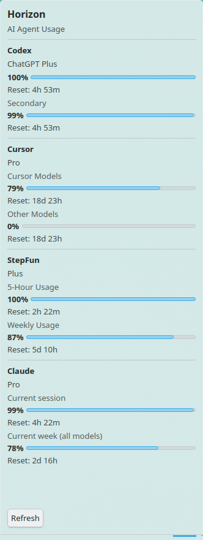
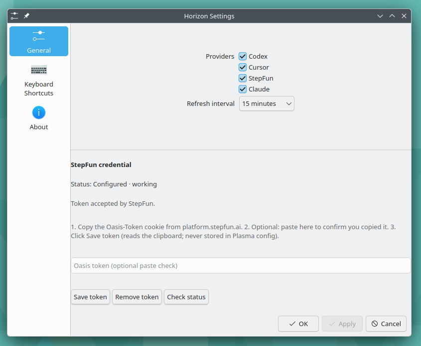

# Horizon

**Horizon shows the remaining quota of the AI coding tools you already use, directly in KDE Plasma.**

Horizon is a KDE Plasma widget for Linux that keeps an eye on OpenAI Codex (ChatGPT Plus), Cursor, Claude, and the StepFun Step Plan, so you can see when you are close to a limit without opening separate dashboards.

Compact panel: one meaningful remaining percentage — the lowest among enabled providers.
Popup: one section per provider with its plan, one row per remaining-quota meter with that meter's own reset, and clear stale / auth / error labels.



Product page and release overview: [Radilabs Horizon](https://www.radilabs.com/horizon/)

## Features

- Panel widget showing the lowest remaining quota across enabled providers
- Expanded popup with one section per provider, a plan when known, and one row per remaining-quota meter with its own reset
- Codex, Cursor, Claude, and StepFun Step Plan support
- Per-provider enable/disable with a configurable refresh interval (default 15 minutes)
- Background refresh with per-provider overlap protection
- Stale, authentication, and provider-error labels instead of silent failures
- StepFun Oasis token stored only in KWallet, with at most one automatic refresh attempt per fetch
- Local usage cache holding normalized, non-secret data only
- No telemetry, analytics, or cloud sync

## Who it is for

Horizon is for developers who use AI coding services on Linux with a KDE Plasma desktop and need remaining quota at a glance. It suits everyday Codex, Cursor, Claude, and StepFun users who prefer one always-visible panel entry over checking several provider dashboards.

Horizon is intentionally **not** a provider login client, an OAuth broker, a browser extension, or a quota forecasting tool. It reuses the credentials you already have on this machine.

## Supported providers

| Provider | Auth |
|----------|------|
| **OpenAI Codex** (ChatGPT Plus) | Reuses `~/.codex/auth.json` |
| **Cursor** | Reads local Cursor session (`state.vscdb`) read-only |
| **Claude** (Pro/Max) | Reads Claude Code credentials read-only |
| **StepFun Step Plan** | User-supplied Oasis token stored only in **KWallet** |

Horizon does **not** implement provider login/OAuth, browser cookie import, or password storage.

## Install

Current release: **0.1.1** — [GitHub release v0.1.1](https://github.com/radilabs/horizon/releases/tag/v0.1.1) · [Radilabs Horizon page](https://www.radilabs.com/horizon/)

Dependencies: Plasma 6, Python 3, Python D-Bus (`python3-dbus`) for KWallet, `kdialog` for optional settings token entry.

```bash
git clone https://github.com/radilabs/horizon.git
cd horizon
git checkout v0.1.1        # release tag; omit for the current tip of main
./scripts/install.sh
```

This installs:

* collector to `~/.local/share/horizon/collector/`
* launcher to `~/.local/bin/ai-usage` (not a symlink into the git checkout)
* plasmoid `com.radilabs.horizon`

Add **Horizon** from the Plasma widget picker.

Upgrade / uninstall:

```bash
./scripts/upgrade.sh
./scripts/uninstall.sh          # keeps KWallet token + usage cache
./scripts/uninstall.sh --purge  # also removes usage cache; still keeps KWallet token
```

There is no CI release pipeline: the git tag plus `scripts/install.sh` is the supported install path. Details: [docs/release.md](docs/release.md).

## Configuration

Widget settings (right-click → Configure Horizon):

* Enable/disable **Codex**, **Cursor**, **StepFun**, **Claude**
* Refresh interval: 5 / 10 / **15** / 30 / 60 minutes (default 15)
* StepFun token management



That settings picture is from before the Claude checkbox. Claude is an accepted provider and appears in that same list.

Disabled providers are not queried, refreshed, shown, or included in the compact summary. Disabling does **not** delete credentials.

## Authentication

### Codex

Sign in with the Codex/ChatGPT tooling so `~/.codex/auth.json` exists. Horizon reuses it.

```bash
ai-usage status codex --json
```

### Cursor

Stay signed in to the Cursor app. Horizon reads session state transiently and never modifies it.

```bash
ai-usage status cursor --json
```

### Claude

Stay signed in with Claude Code so `~/.claude/.credentials.json` exists. Horizon reads that file and does not refresh or rewrite it. If the session is missing or rejected, sign in again with Claude Code.

```bash
ai-usage status claude --json
```

### StepFun

Paste an existing Oasis token (from a StepFun web session). Stored only in KWallet. If the stored pair is still accepted by StepFun’s unofficial refresh endpoint, Horizon performs **one** automatic refresh and writes KWallet only after a live usage check succeeds.

```bash
ai-usage auth stepfun set      # secure prompt; no --token flag
ai-usage auth stepfun status   # working | auth_failed | missing
ai-usage auth stepfun clear
ai-usage status stepfun --json
```

Or use **Widget settings → StepFun credential**:

1. Copy the `Oasis-Token` cookie from `platform.stepfun.ai`
2. Click **Save token** (optional: paste into the field first as a visual check)
3. Confirm status is `Configured · working`

Status is `Configured · working` only after StepFun accepts the token — not merely that something is stored. The token is never written to Plasma config or the usage cache.

## Security

* Prefer provider-owned credentials (Codex, Cursor, Claude). Claude credentials stay read-only (ADR-0011)
* StepFun token: OS credential store only (ADR-0009); bounded Oasis refresh write-back (ADR-0010)
* Usage cache (`~/.cache/horizon/usage-*.json`): normalized non-secret data only
* No telemetry / analytics / cloud sync

See [docs/security.md](docs/security.md).

## Known limitations

Quota APIs for these tools are **unofficial** and can break when providers change endpoints or auth. Details:

* [docs/providers/codex.md](docs/providers/codex.md)
* [docs/providers/cursor.md](docs/providers/cursor.md)
* [docs/providers/stepfun.md](docs/providers/stepfun.md)
* [docs/providers/claude.md](docs/providers/claude.md)

Architecture: [provider-contract](docs/provider-contract.md), [usage-schema](docs/usage-schema.md), [cache](docs/cache.md).  
Development notes: [docs/development.md](docs/development.md).  
Release process: [docs/release.md](docs/release.md).

Version: **0.1.1**

## License

Horizon is available under the [Apache License 2.0](LICENSE). Copyright © Radilabs.
